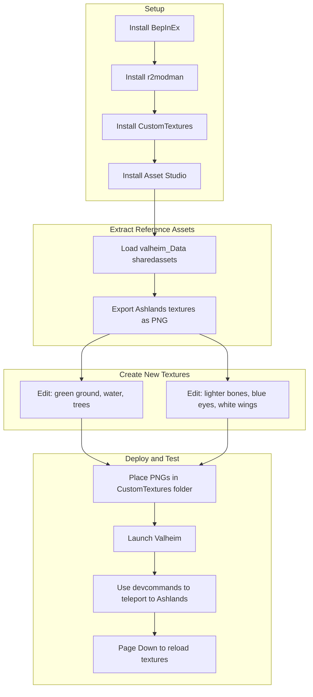

# Ashlands Reborn - Valheim Mod Plan

## Is It Doable?

**Yes.** Valheim has a mature modding ecosystem. Your concept fits well into two established approaches:

1. **Texture replacement** - Replace Ashlands assets (ground, water, trees, monsters) with green/uplifting variants
2. **Environment/weather override** - Force Meadows-like weather and atmosphere when the player is in the Ashlands zone

Functionality stays intact; only visuals change.

---

## Tools and Dependencies to Install

| Tool / Mod                                                | Purpose                                                       | Where to Get                                                                                                                        |
| --------------------------------------------------------- | ------------------------------------------------------------- | ----------------------------------------------------------------------------------------------------------------------------------- |
| **BepInEx Pack Valheim**                                  | Mod loader (required for everything)                          | [Thunderstore](https://valheim.thunderstore.io/package/denikson/BepInExPack_Valheim/)                                               |
| **r2modman** or **Thunderstore App**                      | Mod manager, profiles, easy install/test                      | [Thunderstore](https://valheim.thunderstore.io/package/ebkr/r2modman/)                                                              |
| **CustomTextures** (cjayride fork v3.4.1)                 | Replace game textures with custom PNGs                        | [Thunderstore](https://valheim.thunderstore.io/package/cjayride/CustomTextures/)                                                    |
| **Asset Studio** or **AssetRipper + ValheimExportHelper** | Extract vanilla textures as reference                         | [AssetRipper](https://github.com/AssetRipper/AssetRipper), [ValheimExportHelper](https://github.com/heinermann/ValheimExportHelper) |
| **Image editor** (GIMP, Photoshop, Krita)                 | Create/edit green/beautiful texture variants                  | -                                                                                                                                   |
| **Visual Studio Community** or **Rider** (optional)       | Only if you write a custom BepInEx plugin for Phase 1 weather | -                                                                                                                                   |

**Note:** CustomTextures is marked deprecated on Thunderstore, but the cjayride fork (v3.4.1) is the current maintained option and works with Valheim v0.217.46+. No clear successor exists yet.

---

## Phase 1: Weather, Ground, Sky

### 1.1 Weather and Atmosphere

**Approach:** Use a combination of existing mods plus a small custom plugin.

- **Option A (simplest):** Use **Weather Tweaks** or **MistBeGone** to reduce/disable Ashlands-specific weather globally. Not ideal, as it affects other biomes too.
- **Option B (best):** Write a **custom BepInEx plugin** that Harmony-patches `EnvMan` or the zone environment logic. When `ZoneSystem.GetZone(position)` returns Ashlands, override the active environment to use Meadows-like `EnvSetup` (clear sky, no cinder rain, no lava fog).
  - Reference: Zone environment is tied to biome; you'd patch the method that selects the environment for the current zone.
  - Valtools wiki and [Best Practices](https://github.com/Valheim-Modding/Wiki/wiki/Best-Practices) have Harmony patching examples.

### 1.2 Ground Textures

- Use CustomTextures. Terrain uses the `terrain` prefix.
- Enable **Scene Dump** in CustomTextures config (`DumpSceneTextures = true`), run the game, load a world, then check `BepInEx/plugins/CustomTextures/scene_dump.txt` for Ashlands-specific terrain texture names.
- Ashlands likely shares or extends base terrain; look for entries like `terrain__GameMain_DiffuseTex0.png` or biome-specific variants. Create green, grass-like versions based on Meadows references.
- Naming format: `terrain_<identifier>_<PropertyName>.png` (e.g. `terrain__GameMain_DiffuseTex0.png`).

### 1.3 Sky and Air

- Use the `environment` prefix in CustomTextures for sky, fog, and atmosphere-related textures.
- Extract vanilla environment textures with Asset Studio from `valheim_Data/sharedassets*`.
- Replace fog, cloud, and sky textures with clear, Meadows-like variants.

---

## Phase 2: Water, Trees, Monsters

### 2.1 Water (Red to Green)

- Water uses the `zone` prefix. Example from CustomTextures docs:
  - `zone__GameMain_FoamTex.png`, `zone__GameMain` with materials like `water (Instance)` and properties `_FoamTex`, `_Normal`, etc.
- Run Scene Dump in Ashlands to capture exact water texture names (Ashlands may have different water materials).
- Create green-tinted water textures (algal, clear green) and place them in the CustomTextures folder with the correct naming.

### 2.2 Trees (Green/Mossy)

- Use `object` or `environment` prefixes. Trees are typically `object_<TreePrefabName>_MainTex.png` or similar.
- Identify Ashlands tree prefab names from the Scene Dump or [spawn lists](https://www.reddit.com/r/valheim/comments/lig8ml/spawn_item_command_list/).
- Create green, mossy variants of bark and leaf textures.

### 2.3 Monsters (Charred, Valkyries)

- **Charred:** Lighter bones, blue eyes. Use `object_<CharredPrefabName>_MainTex.png` (and `_EmissionMap` if eyes glow).
- **Valkyries:** White wings, blue eyes. Same approach—replace diffuse and optionally emissive textures.
- Extract vanilla textures with Asset Studio, edit in your image editor (recolor bones lighter, eyes blue, wings white), save as PNG with the correct CustomTextures filename.
- For glow/eyes, check `_EmissionMap` and related properties in the Scene Dump.

---

## Workflow Diagram

---

## Testing Strategy

1. **Mod Manager Profile**
  Create a dedicated r2modman profile (e.g. "Ashlands Reborn Dev") with only BepInEx + CustomTextures + your texture pack. Toggle profiles to test with/without the mod.
2. **Scene Dump**
  Enable `DumpSceneTextures` in CustomTextures config, load a world, visit Ashlands (or use devcommands), then inspect `scene_dump.txt` for texture identifiers.
3. **Quick Teleport**
  Enable dev commands: Steam launch option `-console` or add to Steam: `valheim.exe -console`. In-game: F5 → `devcommands`, then `goto 0,0` or use a known Ashlands coordinate. `debugmode` can help with flying.
4. **Texture Reload**
  CustomTextures binds **Page Down** to reload textures in-game. Use it after changing PNGs instead of restarting.
5. **Iteration**
  Edit a texture → save → Alt+Tab back to game → Page Down → inspect. Repeat.
6. **World Backup**
  Copy your world save before testing; mods can occasionally cause instability.

---

## Recommended Order of Work

1. Install BepInEx + r2modman + CustomTextures.
2. Run Scene Dump once in Ashlands (or nearby) to capture all relevant texture names.
3. **Phase 1:** Ground (terrain) first—fastest visual impact. Then sky/environment. Weather last, likely requiring a small custom plugin.
4. **Phase 2:** Water, then trees, then monster textures.
5. Package as a texture pack ZIP (CustomTextures subfolder structure) for easy sharing and installation.

---

## Caveats and Considerations

- **CustomTextures scope:** Many textures are shared across biomes. Replacing `terrain__GameMain_*` may affect other biomes. You may need CustomTextures "filter" or conditional logic—check if CustomTextures supports biome-specific overrides. If not, you might need a BepInEx plugin that swaps textures only when the player is in Ashlands.
- **Weather plugin:** Phase 1 weather override will require C# and Harmony. Estimate 1–2 days for a developer familiar with Unity/BepInEx.
- **Game updates:** Valheim updates can rename or restructure assets. Re-run Scene Dump after major patches.
- **Multiplayer:** Texture replacement is typically client-side. Other players need the same texture pack to see your changes.
